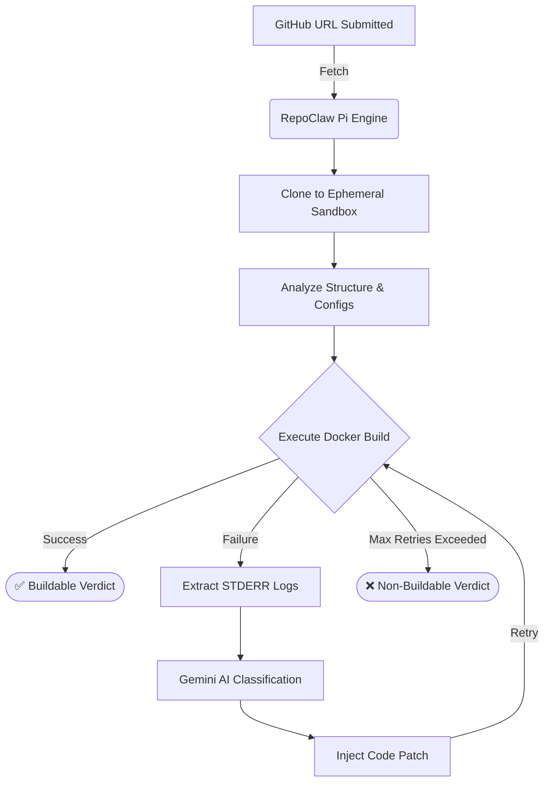

<div align="center">
  <h1>🦀 RepoClaw</h1>
  <p><strong>The Autonomous AI Engine that Fixes Broken Repositories Before You Even Clone Them.</strong></p>
</div>

## 🚀 The Pitch
**RepoClaw** is an autonomous repository evaluation and repair agent built for modern engineering teams. Instead of manually cloning a repo, installing dependencies, dealing with cryptic build failures, and hunting for patches on StackOverflow, RepoClaw automates the entire debugging lifecycle in a secure, ephemeral sandbox. It fetches code, identifies its architecture, attempts a live build, and when (not if) it fails, it uses advanced AI (Gemini 2.5 Flash) to classify the failure, dynamically injects a deterministic patch, and retries. You get a fully sanitized, working repository or a crystal-clear diagnostic report—zero manual effort required.

## ✨ Key Features
- **Zero-Touch Evaluation:** Submit a GitHub URL and let the agent handle cloning, parsing, and execution.
- **Autonomous Repair Loop:** `Try -> Classify -> Fix -> Retry`. The agent autonomously patches missing dependencies, syntax issues, and environment configs.
- **Secure Ephemeral Execution:** Every repository is jailed inside a throwaway Docker sandbox, ensuring your host machine remains pristine.
- **Deterministic AI Heuristics:** Combines the reasoning power of LLMs with deterministic, hard-coded fallback strategies for guaranteed execution stability.
- **Instant Verdicts:** Returns actionable diagnostic artifacts classifying the repository as `Buildable`, `Fixable`, or `Non-Buildable`.

## 🔄 The Autonomous Pipeline



## 🛠 Technology Stack
- **Core Orchestration:** TypeScript, Node.js (Pi Engine)
- **Containerization:** Docker Desktop, Docker CLI integration
- **AI Intelligence:** Gemini 2.5 Flash via Google Generative Language API
- **Execution Strategy:** Stateless, decoupled "Skills" architecture
- **State Management:** Ephemeral YAML memory & sandbox lifecycles

## 🎮 Run the Demo
Experience the autonomous repair loop live against a real repository:

```bash
# Clone and install dependencies
git clone https://github.com/spbarathg/repoClaw.git
cd RepoClaw
npm install

# Compile the TypeScript engine
npx tsc --noEmit

# Launch the autonomous demo against a target repository
npm run demo https://github.com/developit/mitt
```

## 📄 Sample Verdict Artifact
Upon completion, RepoClaw generates a detailed markdown report outlining its findings. It includes:
- **Repository Intelligence:** Inferred architecture and build commands.
- **Correction Cycle Log:** A table detailing the exact AI classifications, confidence scores, and patches applied.
- **Final AI Reasoning:** A human-readable conclusion explaining exactly *why* the repository passed or failed (e.g., distinguishing between a syntax error and a broken infrastructure timeout).

*Check out the [sample_demo_output.md](docs/sample_demo_output.md) for a real-world example.*

## 💡 Why This Matters
Developer productivity is crippled by "works on my machine" syndrome and abandoned open-source projects. RepoClaw bridges the gap between raw, unmaintained code and an immediately usable asset. By shifting the burden of environment configuration and dependency resolution to an AI agent, developers save hours of frustrating setup time.

## 🔮 Future Scalability
RepoClaw is designed as a foundational, OpenClaw-native building block. Its stateless skill architecture allows for infinite horizontal scaling. Future iterations will support:
- Deep monorepo scanning and multi-service orchestration.
- Seamless WebSocket ingress for real-time CI/CD pipeline integration.
- Expanded language support (Rust, Go, C++) with dedicated compiler heuristic models.
