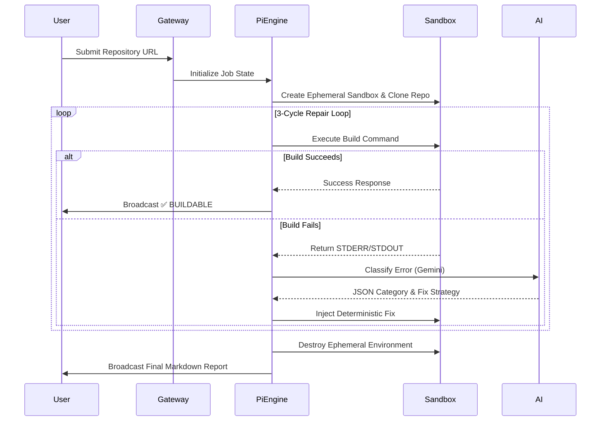

# 🏛 RepoClaw Technical Architecture

RepoClaw is engineered with a strict, decoupled architecture designed for resilience, stateless execution, and infinite horizontal scalability. It maps directly onto the OpenClaw 5-layer stack.

## 🗺 Module Map

| Module | Responsibility | Core Components |
|--------|----------------|-----------------|
| **Gateway** | Ingress and connection handling | WebSocket / HTTP Adapters |
| **Pi Engine** | The orchestrator brain managing job states | `pi_engine.ts`, `memory.ts` |
| **Sandboxing**| Secure execution and isolation | `container_mgr.ts`, Docker CLI |
| **Skills** | Stateless, functional execution units | `build_runner`, `error_classifier`, etc. |
| **AI Layer** | Deep log analysis and strategy selection | Gemini API Integration |

## 🧠 The Pi Engine Flow
The Pi Engine is the centralized state machine that orchestrates the entire autonomous pipeline. It guarantees the safe execution of untrusted code and manages the retry lifecycle.

## 🛠 Skill Responsibilities
RepoClaw delegates execution to entirely stateless "Skills". Each skill accepts a strongly-typed input, performs a single action, and returns a predictable output.

- **`repo_fetch`**: Handles `git clone`, parsing metadata, and directory preparation.
- **`structure_analyze`**: Inspects files to infer the tech stack (e.g., `package.json` -> Node.js) and build commands.
- **`build_runner`**: Wraps the Docker execution context. Handles timeouts and container lifecycle.
- **`error_classifier`**: Interfaces with the Gemini 2.5 Flash API to translate cryptic logs into discrete JSON error classes (e.g., `MISSING_DEPENDENCY`, `RUNTIME_VERSION_MISMATCH`, `UNKNOWN`).
- **`auto_fix`**: Applies deterministic code or configuration patches based on the AI's classification.
- **`report_gen`**: Synthesizes the execution logs and AI reasoning into a final Markdown verdict.

## 🤖 AI Classification Loop
Rather than using LLMs to write raw code (which is prone to hallucinations), RepoClaw uses AI strictly as a **classifier**.
1. Raw `stderr` and `stdout` are piped to the Gemini model.
2. The model returns a typed JSON object identifying the root cause.
3. The `auto_fix` skill maps that classification to a *deterministic*, hard-coded repair strategy (e.g., if `MISSING_ENV` is detected, a dummy `.env` file is generated).

## 🐳 Docker Sandbox Explanation
Security and environment consistency are paramount. 
- Before any build runs, `container_mgr` ensures a clean slate by forcibly removing any lingering containers.
- The cloned repository is mounted via Docker volumes into an ephemeral container (e.g., `node:22-alpine`).
- A strict execution timeout (e.g., 5 minutes) prevents infinite loops or resource exhaustion.
- Regardless of success, failure, or timeout, the container is mercilessly destroyed at the end of the cycle.

## 🔌 WebSocket Ingress (Future-Proofing)
While the current demo runs natively in the CLI, RepoClaw's Gateway layer is fully instrumented for WebSocket ingress. This allows real-time streaming of the Pi Engine's thought process, build logs, and status updates directly to external clients, CI/CD dashboards, or chatbots, laying the groundwork for a fully distributed microservices architecture.
